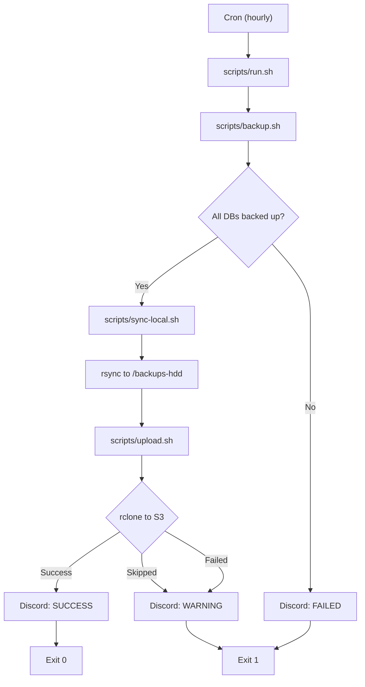
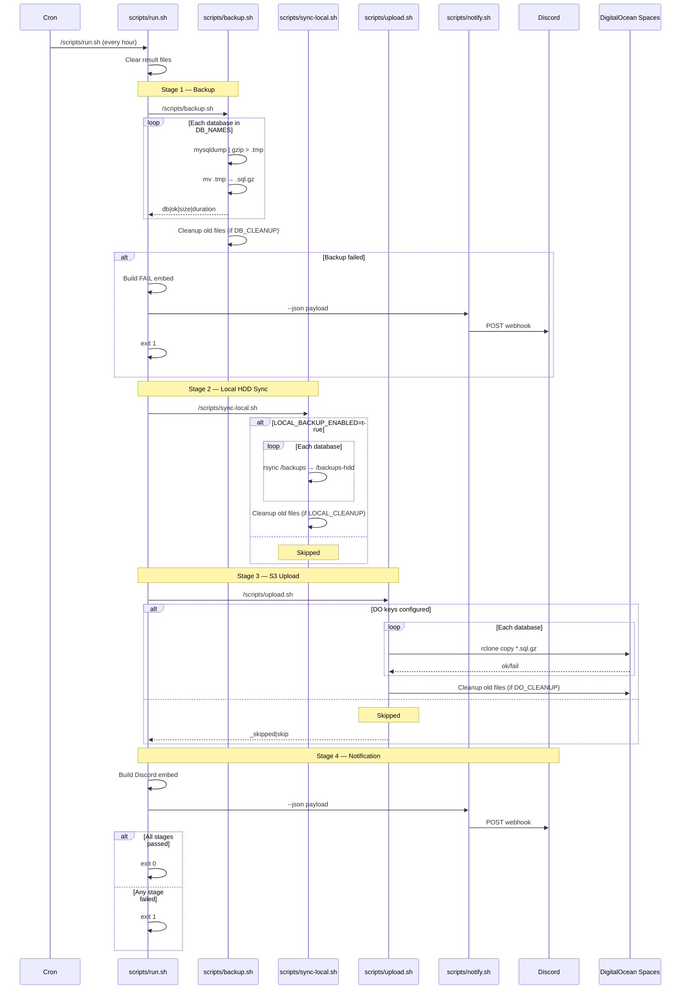

# MySQL Backup Service

Automated MySQL backup with local HDD sync, DigitalOcean Spaces upload, and Discord notifications. Runs hourly inside a Docker container.

## Architecture



## Pipeline Flow



## File Structure

```
mysql-backup/
├── docker-compose.yml   # Container definition
├── Dockerfile           # Image build (mysql:8.0 + rclone + cronie)
├── crontab              # Hourly backup, weekly logrotate
├── .env                 # Secrets and config (gitignored)
├── .env.example         # Template for .env
├── scripts/
│   ├── run.sh           # Orchestrator: backup → sync → upload → notify
│   ├── backup.sh        # mysqldump + gzip for each DB
│   ├── sync-local.sh    # rsync to local HDD mount
│   ├── upload.sh        # rclone to DigitalOcean Spaces
│   ├── notify.sh        # Discord webhook sender
│   ├── test-s3.sh       # S3 connectivity test
│   └── test-notify.sh   # Host-side notification test
├── logrotate.conf       # Log rotation config
├── backups/             # Local backup storage (volume)
└── backups-hdd/         # HDD mount point (volume)
```

## Scripts

| Script | Purpose |
|--------|---------|
| `run.sh` | Orchestrates the full pipeline and builds the Discord embed |
| `backup.sh` | Dumps each DB with `mysqldump`, pipes to `gzip`, cleans up old files |
| `sync-local.sh` | Syncs backups to an HDD mount via `rsync`, cleans up old files |
| `upload.sh` | Uploads backups to DigitalOcean Spaces via `rclone`, cleans up old files |
| `notify.sh` | Sends JSON embed or plain text to a Discord webhook |
| `test-s3.sh` | Tests S3 connectivity: list → write → delete |

## Schedule

| Frequency | Action |
|-----------|--------|
| Hourly (00 min) | Full backup pipeline (`run.sh`) |
| Weekly (Sunday 00:00) | Log rotation |

## Configuration

Copy `.env.example` to `.env` and fill in the values:

### Database

| Variable | Default | Description |
|----------|---------|-------------|
| `DB_SERVER` | `mysql-host` | MySQL host |
| `DB_PORT` | `3306` | MySQL port |
| `DB_USER` | `backup_user` | MySQL user |
| `DB_PASS` | `backup_password` | MySQL password |
| `DB_NAMES` | `db1 db2 db3` | Space-separated database list |
| `DB_CLEANUP` | `true` | Enable local backup cleanup |
| `CLEANUP_TIME` | `604800` | Local cleanup age in seconds (7 days) |

### DigitalOcean Spaces (S3)

| Variable | Default | Description |
|----------|---------|-------------|
| `DO_ACCESS_KEY` | — | Spaces access key |
| `DO_SECRET_KEY` | — | Spaces secret key |
| `DO_ENDPOINT` | `nyc3.digitaloceanspaces.com` | Spaces endpoint |
| `DO_REGION` | `nyc3` | Spaces region |
| `DO_BUCKET` | — | Bucket name |
| `DO_PATH` | `mysql` | Path prefix in bucket |
| `DO_CLEANUP` | `true` | Enable remote cleanup |
| `DO_CLEANUP_DAYS` | `30` | Remote cleanup age in days |

### Local HDD

| Variable | Default | Description |
|----------|---------|-------------|
| `LOCAL_BACKUP_ENABLED` | `false` | Enable HDD sync |
| `HDD_MOUNT_PATH` | `./backups-hdd` | Host HDD mount path |
| `LOCAL_CLEANUP` | `true` | Enable HDD cleanup |
| `LOCAL_CLEANUP_DAYS` | `90` | HDD cleanup age in days |

### Notifications

| Variable | Default | Description |
|----------|---------|-------------|
| `ALERT_WEBHOOK_URL` | — | Discord webhook URL |
| `ALERT_HOSTNAME` | Container hostname | Display name in alerts |
| `GIF_URL_SUCCESS` | — | GIF for success embed |
| `GIF_URL_WARNING` | — | GIF for warning embed |
| `GIF_URL_FAILURE` | — | GIF for failure embed |

## Discord Notifications

Notifications use Discord webhook embeds with a Pokemon theme:

- **Green** — All backups + uploads succeeded
- **Yellow** — Backups succeeded but S3 upload failed or skipped
- **Red** — Backup itself failed

Each embed includes per-database status and an optional GIF.

## Testing

Run from the repo root:

```bash
make test            # Full pipeline
make test-backup     # Backup only
make test-upload     # S3 upload only
make test-sync       # Local HDD sync only
make test-s3         # S3 connectivity test
make test-notify     # Discord notification (from container)
make test-notify-host # Discord notification (from host)
```

## Lifecycle

```bash
make up              # Start container
make down            # Stop container
make restart         # Restart container
make update          # Rebuild + restart (picks up .env changes)
```

## Backup File Format

```
/backups/<database>/<database>-YYYYMMDD_HHMMSS.sql.gz
```

Example: `/backups/myapp/myapp-20260503_030000.sql.gz`
